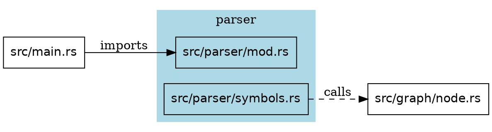

# Feature Research

**Domain:** Code intelligence engine — v1.1 milestone: Rust language support + graph export
**Researched:** 2026-02-23
**Confidence:** HIGH (tree-sitter-rust grammar verified via node-types.json; Rust reference docs for module system; cargo-modules/cargo-depgraph feature analysis via GitHub; DOT/Mermaid syntax from official docs)

> **Context:** v1.0 shipped TS/JS parsing, all query commands (find, refs, impact, circular, context, stats), MCP server with 6 tools, watch mode, bincode persistence. This research focuses exclusively on what is new in v1.1: Rust language support and graph export (DOT + Mermaid).

---

## Feature Landscape

### Table Stakes (Users Expect These)

Features any Rust-supporting code intelligence tool must have. Missing these = Rust support is not credible.

| Feature | Why Expected | Complexity | Notes |
|---------|--------------|------------|-------|
| **fn extraction** | Functions are the primary unit of behavior in Rust. Every tool that supports Rust indexes `fn`. tree-sitter-rust node: `function_item`. | LOW | Top-level `fn` and `fn` in `impl` blocks. Capture: name, line, visibility (`pub`, `pub(crate)`, `pub(super)`, private). Async fns are `function_item` with `async` modifier — same node type. |
| **struct extraction** | Structs are Rust's primary named compound type. Node: `struct_item`. | LOW | Capture name, visibility. Field extraction (like TS class property children) is optional for v1.1 — struct name + location is enough for navigation. |
| **enum extraction** | Rust enums are algebraic types, heavily used. Node: `enum_item`. | LOW | Capture name, visibility. Variant extraction optional for v1.1. |
| **trait extraction** | Traits define interfaces; they are the Rust equivalent of TS interfaces. Node: `trait_item`. | LOW | Capture name, visibility. Associated function signatures (inside trait body) can be extracted as child symbols using `function_signature_item`. |
| **impl block handling** | impl blocks link methods to types. Without them, methods are invisible to the symbol index. Node: `impl_item`. | MEDIUM | Two forms: inherent impl (`impl Foo`) and trait impl (`impl Trait for Foo`). Methods inside impl blocks must be attributed to the parent type, not the file. Requires extracting the type name from the impl header. |
| **use declaration parsing (simple + nested)** | `use std::collections::HashMap` is the standard Rust import pattern. Every Rust file uses `use`. | MEDIUM | tree-sitter-rust nodes: `use_declaration` → `use_tree`. Handle: simple path (`use a::b::C`), nested braces (`use a::{B, C, self}`), glob (`use a::*`), alias (`use a::B as Baz`). Path resolution: `crate::`, `super::`, `self::` prefixes must resolve against module tree, not filesystem paths. |
| **mod declaration parsing** | `mod foo;` or `mod foo { ... }` is how Rust declares submodules. Without it, module tree traversal is impossible. Node: `mod_item`. | MEDIUM | Two forms: inline (`mod foo { ... }`) and file-declaring (`mod foo;`). File-declaring `mod foo;` in `src/lib.rs` means the module body is in `src/foo.rs` or `src/foo/mod.rs`. This is the core of Rust module resolution — different from TS `import`. |
| **pub use re-export handling** | `pub use crate::inner::Foo` is how Rust creates public APIs. Common in `lib.rs` files. Without it, the export graph is incomplete. | MEDIUM | `pub use` is a `use_declaration` with `pub` visibility. Mark the re-exported item as exported from the current module. This is the Rust equivalent of TS barrel file re-exports. |
| **type alias extraction** | `type Alias = ConcreteType` is a common Rust pattern. Node: `type_item`. | LOW | Capture name, visibility. Complexity is low — same as TS type alias. |
| **const and static extraction** | `const MAX: usize = 100` and `static GLOBAL: &str = "x"` are first-class items. Nodes: `const_item`, `static_item`. | LOW | Capture name, visibility. Important for find/refs when users search for constants. |
| **macro_rules! extraction** | `macro_rules! my_macro` defines a declarative macro. Node: `macro_definition`. Common in Rust codebases. | LOW | Capture macro name. `macro_rules!` is invoked like a function but defined differently — treat as a distinct symbol kind (`Macro`). Do NOT attempt to trace macro expansion (not feasible with tree-sitter). |
| **Rust file walker** | `.rs` files need to be discovered and parsed. The existing `walker.rs` must be extended. | LOW | Add `.rs` to the extension allowlist. Most of the walker infrastructure reuses directly. Exclude `target/` (Cargo's build directory) — equivalent to `node_modules/`. |
| **Rust symbol kind enum variants** | Users filter by kind: `--kind struct`, `--kind trait`. Without new enum variants, Rust symbols can't be filtered. | LOW | Add to `SymbolKind`: `Struct`, `Trait`, `Impl`, `Macro`, `Const`, `Static`, `Module`. Reuse `Function`, `Method`, `TypeAlias`, `Enum`. `is_exported` maps to Rust `pub` visibility. `is_default` is always false (Rust has no default exports). |
| **CLI parity for Rust** | Users expect `code-graph find MyStruct src/` to work on Rust files. All 9 commands must handle mixed TS+Rust projects. | LOW | The CLI commands themselves need no changes. Only the indexer, parser, and resolver layers need Rust awareness. Query layer operates on the graph, which is language-agnostic. |

---

### Differentiators (Competitive Advantage)

Features that set this tool apart from cargo-modules, cargo-depgraph, and rust-analyzer for the AI agent use case.

| Feature | Value Proposition | Complexity | Notes |
|---------|-------------------|------------|-------|
| **impl block → type method linkage** | cargo-modules shows module structure only. rust-analyzer does this but requires LSP integration. We can show "struct Foo has methods: new, process, validate" without running rustc. | MEDIUM | When extracting an `impl Foo { fn bar() }`, emit `bar` as a `Method` child symbol of `Foo`. Edge: `Symbol(Foo) --ChildOf--> Symbol(bar)`. This enables `code-graph context Foo` to show all methods. Requires finding the implementing type name from the impl header (`impl_item` has a `type` field in the grammar). |
| **Cargo workspace package discovery** | cargo-depgraph shows crate-level dependency graphs. We can show cross-crate symbol dependencies within a workspace — something no tool does today. | MEDIUM | Parse `Cargo.toml` `[workspace]` members and `[dependencies]` with `path = "..."`. Map crate names to directories. Treat path-dependency crates as internal packages (index their symbols). Treat registry dependencies (crates.io) as external (terminal nodes like npm packages). |
| **Trait implementation graph** | rust-analyzer knows which types implement which traits but requires the full type system. We can approximate at the syntactic level: `impl Display for Foo` creates a `Implements` edge between `Foo` and `Display`. | MEDIUM | Extract trait impl name and implementing type from `impl_item`. Create edge: `Symbol(Foo) --Implements--> Symbol(Display)`. This enables "find all types that implement Display" queries — useful for AI agents. |
| **graph export: DOT format** | cargo-depgraph outputs DOT but only at the crate/package level. We can output DOT at symbol, file, or package granularity with subgraph clustering. | MEDIUM | New CLI command: `code-graph export --format dot --granularity [symbol|file|package]`. DOT subgraphs with `cluster_` prefix for packages. Edge styles: `Imports` = solid arrow, `Calls` = dashed, `Implements` = dotted, `Extends` = hollow arrowhead. Filter flags: `--include-external`, `--max-depth N`. |
| **graph export: Mermaid format** | No competing tool exports Mermaid. GitHub renders Mermaid natively in markdown — this makes the output immediately useful without Graphviz installed. | MEDIUM | `code-graph export --format mermaid --granularity [symbol|file|package]`. Use `flowchart TD` for dependency graphs (direction: top-down). Use `subgraph` blocks for packages. Escape special characters in node names (Mermaid is stricter than DOT). Apply node limits at high granularity (symbol-level Mermaid for 1000+ nodes will not render). |
| **Mixed TS+Rust project support** | Projects like this one have both TS (tooling, tests) and Rust (implementation). No tool handles both simultaneously. | LOW | Language detection already happens per-file via extension. The graph model is language-agnostic. Mixed projects just need both parsers registered. The `stats` command should report per-language symbol counts. |
| **Dogfooding on code-graph itself** | code-graph indexing itself (a Rust project) validates the Rust support quality. Any bug is immediately visible to the developer. | LOW | Add a CI test that runs `code-graph index .` on the workspace and checks that key symbols (e.g., `GraphNode`, `EdgeKind`, `parse_file`) are found. This is a quality gate, not a feature, but it differentiates by ensuring real-world quality. |

---

### Anti-Features (Commonly Requested, Often Problematic)

| Feature | Why Requested | Why Problematic | Alternative |
|---------|---------------|-----------------|-------------|
| **Macro expansion tracing** | Derive macros (`#[derive(Debug)]`), proc macros, and `macro_rules!` invocations generate code. Users want to see the generated symbols. | Requires running the Rust compiler or a proc-macro expansion tool. tree-sitter only sees the source text, not the expanded output. Implementing this would require spawning `cargo expand` — violating the zero-runtime-dependencies goal. | Extract macro invocation sites as `Macro` symbol kind. Record `#[derive(...)]` attributes as annotations on the parent symbol. Let Claude infer what derive macros generate (it knows what `#[derive(Debug, Clone)]` produces). |
| **Full Rust type inference for method resolution** | `obj.method()` — which `method` is called? Depends on `obj`'s type, which requires type inference. | Requires the full Rust type system (rustc or rust-analyzer internals). tree-sitter cannot do this. Attempting it with heuristics produces a high false-positive rate that degrades user trust. | Record all `method_name` call sites without binding to a specific type's impl. The `refs` command for `process` will show all `process` calls across the codebase. Users understand this is syntactic, not semantic. |
| **Cargo.lock dependency resolution** | Users want "show me all transitive dependencies." | cargo-depgraph already does this well using `cargo metadata`. Reimplementing Cargo's resolver is massive scope. | Treat Cargo.lock (or `cargo metadata` output) as an external input. For the v1.1 scope, map only workspace-member path dependencies. External crates are terminal nodes (no recursion). |
| **Cross-crate type-level analysis** | `use serde::Serialize` — resolve `Serialize` to its definition in the `serde` crate. | External crates are not indexed (same constraint as TS `node_modules`). Resolving into external crates requires downloading and parsing all dependencies — too expensive. | Mark external crate items as `UnresolvedImport` with the crate name as context (same pattern as TS external packages). |
| **inline module expansion** | `mod foo { ... }` with a large inline body — should we index symbols inside it? | Inline modules require recursive descent through the module tree, tracking path context at each level. This is feasible but adds complexity. For v1.1, inline module contents should be indexed as top-level symbols in the file. | Index inline module bodies as part of their parent file. Emit a `Module` symbol for the inline `mod foo` declaration. Symbols inside it are children of the file, not of the module symbol (simplification for v1.1; can be refined in v2). |
| **Mermaid class diagram for symbol-level export** | Class diagrams would show inheritance and trait relationships nicely. | Mermaid `classDiagram` syntax conflicts with Rust semantics: Rust has no class hierarchy, traits are not parent classes, and multiple implementations complicate the diagram structure. The class diagram format was designed for OOP languages. | Use `flowchart TD` for all Mermaid output. Trait implementations become directed edges. This is semantically accurate and renders well. |
| **Real-time DOT rendering / SVG generation** | Users want to see the graph, not a text file. | Embedding Graphviz requires either a native library (breaks zero-dependency goal) or shelling out (requires Graphviz installed). | Output DOT text to stdout or a file. Document how to render: `code-graph export --format dot | dot -Tsvg > graph.svg`. For Mermaid, paste into mermaid.live or GitHub markdown. |

---

## Feature Dependencies

```
[Rust file walker extension]
    └──required by──> [All Rust parsing features]

[tree-sitter-rust grammar registration]
    └──required by──> [All Rust symbol/import extraction]
    └──requires──> adding tree-sitter-rust crate dependency

[Rust symbol extraction (fn, struct, enum, trait, type, const, static, macro)]
    └──requires──> [tree-sitter-rust grammar registration]
    └──enables──> [CLI parity for Rust]
    └──enables──> [impl block → type method linkage]

[impl block handling]
    └──requires──> [Rust symbol extraction]
    └──enables──> [Trait implementation graph]
    └──enables──> [impl block → type method linkage]

[use declaration parsing]
    └──requires──> [tree-sitter-rust grammar registration]
    └──enables──> [mod declaration → file mapping]

[mod declaration parsing]
    └──requires──> [use declaration parsing]
    └──enables──> [Cargo workspace package discovery]
    └──requires──> [Rust module file resolution logic] (mod foo; -> src/foo.rs OR src/foo/mod.rs)

[Cargo workspace package discovery]
    └──requires──> [mod declaration parsing]
    └──enables──> [Cross-crate symbol graph within workspace]

[pub use re-export handling]
    └──requires──> [use declaration parsing]
    └──enhances──> [Find-all-references accuracy]

[graph export command]
    └──requires──> [Existing petgraph StableGraph] (already in place)
    └──requires──> [Granularity projection logic] (new: collapse symbol->file->package)
    └──independent of──> [Rust parsing] (export works on TS-only graphs too)

[DOT format output]
    └──requires──> [graph export command]
    └──independent of──> [Mermaid format output]

[Mermaid format output]
    └──requires──> [graph export command]
    └──independent of──> [DOT format output]

[Granularity: symbol level]
    └──requires──> [graph export command]
    └──uses──> full petgraph node set (direct graph traversal)

[Granularity: file level]
    └──requires──> [graph export command]
    └──uses──> File nodes only (project Symbol nodes onto parent File nodes)

[Granularity: package level]
    └──requires──> [graph export command]
    └──requires──> [Cargo workspace package discovery] for Rust packages
    └──uses──> workspace/package directories as node groupings
```

### Dependency Notes

- **mod declaration parsing is the hardest Rust-specific dependency:** The Rust module system does not map 1:1 to the filesystem. `mod foo;` in `src/lib.rs` resolves to `src/foo.rs` or `src/foo/mod.rs`. This resolution must be implemented from scratch — there is no equivalent of oxc_resolver for Rust modules. The resolver must walk the module tree starting from the crate root (`src/main.rs` or `src/lib.rs`).
- **graph export is independent of Rust support:** The export command operates on the existing petgraph graph. It can be implemented and tested on TS-only projects before Rust support is complete. This allows parallel development.
- **DOT and Mermaid outputs are independent:** They share the same granularity projection logic but format output differently. Implement as two separate render functions taking the same projected graph.
- **impl block handling requires two-pass extraction:** First pass identifies all top-level type definitions (structs, enums, traits). Second pass identifies impl blocks and links their methods to the corresponding type symbol. Order matters because the type may be declared after the impl block in the file.

---

## MVP Definition

### Launch With (v1.1)

The minimum set to deliver "Rust + visualization" milestone.

- [ ] **Rust symbol extraction** (fn, struct, enum, trait, type, const, static, macro_rules!) — core of Rust support; without it, no Rust file is useful
- [ ] **Rust use declaration parsing** (simple, nested braces, glob, alias) — enables import graph for Rust files
- [ ] **mod declaration → file resolution** — enables Rust module graph; the key hard problem
- [ ] **pub use re-export handling** — without this, Rust library `lib.rs` files look empty
- [ ] **impl block method extraction** — without this, no methods are visible, hobbling find/refs/impact
- [ ] **Cargo workspace package discovery** — enables package-level grouping in export
- [ ] **`code-graph export` command with DOT output** — delivers graph visualization at all three granularities
- [ ] **`code-graph export` command with Mermaid output** — delivers GitHub-native visualization
- [ ] **Three granularity levels: symbol, file, package** — each serves a different use case

### Add After Validation (v1.1.x)

- [ ] **Trait implementation edges** (`impl Trait for Type`) — trigger: users want to query "who implements this trait?"
- [ ] **`#[derive(...)]` attribute capture** — trigger: users want to see auto-derived traits on structs
- [ ] **Export format: `--focus-on` flag** — trigger: large codebases produce unreadable graphs; focus on a subgraph
- [ ] **Export format: `--max-depth N` flag** — trigger: symbol-level graphs for large projects need depth limits

### Future Consideration (v2+)

- [ ] **Inline module body as a separate Module node** — why defer: adds complexity, most Rust files use `mod foo;` not inline modules
- [ ] **Proc macro awareness** — why defer: requires spawning rustc, violates zero-dependency goal
- [ ] **Cross-crate analysis into external dependencies** — why defer: requires downloading and indexing external crates

---

## Feature Prioritization Matrix

| Feature | User Value | Implementation Cost | Priority |
|---------|------------|---------------------|----------|
| Rust symbol extraction (fn, struct, enum, trait) | HIGH | LOW | P1 |
| Rust use declaration parsing | HIGH | MEDIUM | P1 |
| mod declaration → file resolution | HIGH | HIGH | P1 |
| pub use re-export handling | HIGH | MEDIUM | P1 |
| impl block method extraction | HIGH | MEDIUM | P1 |
| graph export: DOT output | HIGH | MEDIUM | P1 |
| graph export: Mermaid output | HIGH | MEDIUM | P1 |
| Three granularity levels (symbol/file/package) | HIGH | MEDIUM | P1 |
| Cargo workspace package discovery | MEDIUM | MEDIUM | P1 |
| const, static, macro_rules! extraction | MEDIUM | LOW | P1 |
| Trait implementation edges | MEDIUM | LOW | P2 |
| `#[derive(...)]` attribute capture | LOW | LOW | P2 |
| Export --focus-on flag | MEDIUM | LOW | P2 |
| Export --max-depth flag | MEDIUM | LOW | P2 |
| Inline module as separate graph node | LOW | HIGH | P3 |
| Proc macro expansion | LOW | HIGH | P3 |

**Priority key:**
- P1: Must have for v1.1 launch
- P2: Should have, add after v1.1 validation
- P3: Nice to have, v2+

---

## Competitor Feature Analysis

| Feature | cargo-modules | cargo-depgraph | rust-analyzer | Our Approach |
|---------|---------------|----------------|---------------|--------------|
| Module structure visualization | Yes (primary feature) | No | LSP only | Yes — via graph export at file/package level |
| Crate dependency graph | No | Yes (Graphviz DOT) | No | Yes — package granularity export |
| Symbol-level graph | No | No | LSP hover/refs | Yes — symbol granularity export (unique) |
| DOT output | Yes (module graph) | Yes (crate deps) | No | Yes (all granularities + clustering) |
| Mermaid output | No | No | No | Yes (unique differentiator) |
| Mixed TS+Rust project | No | No | No | Yes (both parsed in same graph) |
| MCP tool integration | No | No | No (LSP) | Yes (existing 6 tools work on Rust) |
| Watch mode / incremental | No | No | Yes (LSP) | Yes (existing infrastructure works) |
| Token-optimized AI output | No | No | No | Yes (core design principle) |
| Cargo workspace awareness | Partial | Yes (cargo metadata) | Yes | Yes (parse Cargo.toml members + path deps) |
| impl block method attribution | No | No | Yes | Yes (key differentiator vs cargo-modules) |
| Trait impl edges | No | No | Yes | Yes (syntactic approximation) |
| Zero runtime deps | Yes | Yes | No | Yes |
| Single binary | Yes | Yes | No | Yes |

### What Competing Tools Miss

**cargo-modules** is the closest competitor for module visualization. Its gaps:
- Output is module tree structure only — no symbol-level graph
- No file-level or cross-crate relationship edges
- No MCP or AI-agent integration
- Cannot answer "what calls this function?" — purely structural

**cargo-depgraph** is purely crate-level:
- Shows external crate dependencies (from Cargo.lock), not internal module/symbol relationships
- No symbol extraction
- Requires Graphviz installed (we output text that users can render anywhere)

**rust-analyzer** does everything correctly but:
- Requires LSP editor integration — no CLI/MCP
- Heavy memory footprint (loads full compiler)
- Not designed for AI agent token-saving queries

**Our gap vs rust-analyzer:** We cannot do type-level method call resolution. `obj.process()` — we don't know which `impl` block's `process` is called. We record the call site but cannot bind it to a specific type's method. This is a known limitation to document clearly.

---

## Rust Module System: Critical Edge Cases

These are the behaviors that will cause bugs if not handled correctly. Documented here to inform the implementation plan.

### 1. Two forms of file-declaring mod

```rust
// src/lib.rs or src/main.rs
mod network;         // -> src/network.rs OR src/network/mod.rs
mod network { ... }  // inline module, body is here
```

Resolution rule: `mod foo;` in file `src/bar.rs` maps to `src/bar/foo.rs` OR `src/bar/foo/mod.rs`. The resolver must check both paths and error if neither exists (or both exist).

### 2. Nested brace use imports flatten to multiple paths

```rust
use std::collections::{BTreeSet, hash_map::{self, HashMap}};
```

Flattens to: `std::collections::BTreeSet`, `std::collections::hash_map` (self), `std::collections::hash_map::HashMap`. The tree-sitter `use_tree` node is recursive — requires a recursive descent to flatten all paths.

### 3. Glob imports are unresolvable without type system

```rust
use my_module::*;
```

We cannot know what names this imports without indexing `my_module` and checking its public exports. Track the glob import as a `GlobImport` edge to the module but do not try to resolve individual names. This is the same approach used for TS barrel `export *`.

### 4. `crate::`, `super::`, `self::` path resolution

These are relative paths within the module tree, not filesystem paths:
- `crate::foo::Bar` → from crate root, descend to `foo` module, find `Bar`
- `super::sibling` → parent module's `sibling`
- `self::inner` → current module's `inner` submodule

Resolution requires knowing the current module's position in the crate module tree — which itself requires having parsed all `mod` declarations first.

### 5. `pub(crate)` and `pub(super)` visibility

Rust has four visibility levels: private (default), `pub(self)` (same as private), `pub(super)`, `pub(crate)`, `pub`. For the graph, treat anything `pub` or `pub(crate)` as exported; treat private and `pub(super)` as internal. Map to `is_exported: bool` on `SymbolInfo`.

### 6. `extern crate` (pre-2018 edition)

```rust
extern crate serde;
```

This is the pre-2018 Rust edition way to import a crate. Modern code uses `use serde::...` directly. Support it as an `UnresolvedImport` with the crate name. tree-sitter node: `extern_crate_declaration`.

---

## Graph Export: Design Details

### Granularity Levels

| Level | Nodes Represent | Edge Condition | Use Case | Node Count Estimate |
|-------|----------------|----------------|----------|---------------------|
| symbol | Every fn, struct, enum, trait, etc. | Calls, Implements, Extends edges | Deep analysis of a specific subsystem | 100s–10,000s |
| file | Source files (.rs, .ts) | Imports, ResolvedImport edges | File-level dependency understanding | 10s–1,000s |
| package | Cargo crate / npm workspace package | Aggregated cross-package imports | Architecture overview, onboarding | 1–100 |

### DOT Output Structure



Edge styles by kind:
- `Imports` / `ResolvedImport`: solid arrow (default)
- `Calls`: dashed arrow (`style=dashed`)
- `Implements`: dotted arrow (`style=dotted`)
- `Extends`: arrow with empty arrowhead (`arrowhead=empty`)
- `BarrelReExportAll`: bold arrow (`style=bold`)

### Mermaid Output Structure

```
flowchart TD
    subgraph parser["parser"]
        parser_mod["parser/mod.rs"]
        parser_symbols["parser/symbols.rs"]
    end

    main["main.rs"] --> parser_mod
    parser_symbols -.-> graph_node["graph/node.rs"]
```

Edge styles:
- `Imports`: `-->` (solid arrow)
- `Calls`: `-.->` (dotted arrow)
- `Implements`: `--o` (circle end)
- `Extends`: `-->`  with label "extends"

Node name sanitization: Mermaid IDs cannot contain `/`, `.`, `::`, `<`, `>`, `(`, `)`. Replace with `_`. Display labels use the original name.

### Mermaid Scale Limits

Mermaid becomes unreadable above ~50 nodes in a GitHub markdown rendering context. Apply automatic limits:
- `symbol` granularity: warn if node count > 100, suggest using `file` granularity or `--focus-on`
- `file` granularity: warn if node count > 200
- `package` granularity: no limit (rarely exceeds 50 in practice)

DOT has no practical rendering limit (Graphviz handles thousands of nodes), but very large graphs become visually unusable. Apply the same warning thresholds but do not truncate (let users decide).

---

## Sources

- tree-sitter-rust node types: [GitHub tree-sitter/tree-sitter-rust node-types.json](https://github.com/tree-sitter/tree-sitter-rust/blob/master/src/node-types.json) (HIGH confidence — official grammar)
- tree-sitter-rust highlights.scm query patterns: [GitHub tree-sitter/tree-sitter-rust highlights.scm](https://github.com/tree-sitter/tree-sitter-rust/blob/master/queries/highlights.scm) (HIGH confidence)
- Rust use declaration forms: [Rust Reference — Use Declarations](https://doc.rust-lang.org/reference/items/use-declarations.html) (HIGH confidence — official reference)
- Rust module resolution rules: [Rust Reference — Modules](https://doc.rust-lang.org/reference/items/modules.html) (HIGH confidence — official reference)
- Rust 2018 path changes: [Rust Edition Guide — Path Changes](https://doc.rust-lang.org/edition-guide/rust-2018/path-changes.html) (HIGH confidence — official docs)
- cargo-modules features: [GitHub regexident/cargo-modules](https://github.com/regexident/cargo-modules) (HIGH confidence — verified via repo)
- cargo-depgraph features: [GitHub jplatte/cargo-depgraph](https://github.com/jplatte/cargo-depgraph) (HIGH confidence — verified via repo)
- Cargo workspace structure: [The Cargo Book — Workspaces](https://doc.rust-lang.org/cargo/reference/workspaces.html) (HIGH confidence — official docs)
- DOT language subgraph cluster syntax: [Graphviz DOT Language](https://graphviz.org/doc/info/lang.html) (HIGH confidence — official docs)
- Mermaid flowchart syntax: [Mermaid Flowchart Docs](https://mermaid.js.org/syntax/flowchart.html) (HIGH confidence — official docs)
- Glob import pitfalls: [Rust Reference — Use Declarations](https://doc.rust-lang.org/reference/items/use-declarations.html) + [cargo-semver-checks discussion](https://github.com/rust-lang/rust/issues/94049) (HIGH confidence)

---

*Feature research for: Rust language support + graph export (v1.1 milestone)*
*Researched: 2026-02-23*
