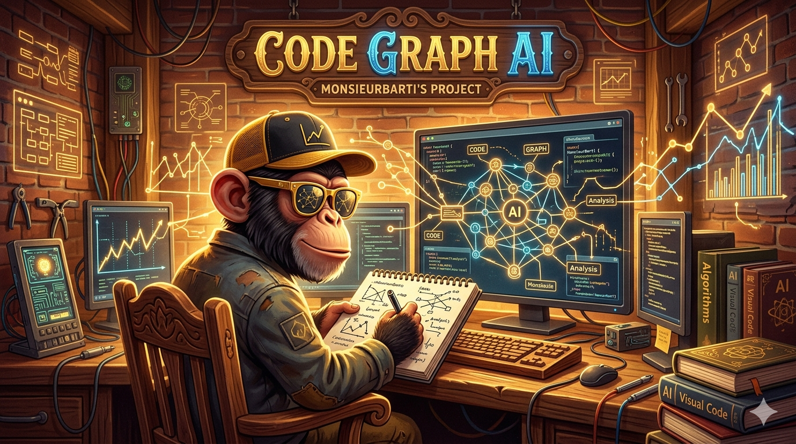

# code-graph

<p align="center">
  
</p>

High-performance code intelligence engine that indexes TypeScript, JavaScript, Rust, Python, and Go codebases into a queryable dependency graph. Built in Rust, designed for AI agents.

Gives [Claude Code](https://docs.anthropic.com/en/docs/claude-code) direct access to your codebase's structure via hooks-based integration -- no source file reading needed. One `code-graph setup` command installs transparent PreToolUse hooks that auto-approve CLI calls and enrich search queries with structural graph data.

## Features

- **Multi-language parsing** -- TypeScript, TSX, JavaScript, JSX, Rust, Python, and Go via tree-sitter with full symbol extraction (functions, classes, interfaces, types, enums, components, methods, properties, structs, traits, impl blocks, macros, pub visibility, async/sync functions, decorators, type aliases, struct tags)
- **Python parsing** -- functions (sync/async), classes, variables, type aliases (PEP 695), decorators with framework detection (Flask, FastAPI, Django)
- **Go parsing** -- functions, methods, type specs, struct tags, `//go:` directives as decorators, visibility by export convention, go.mod resolution
- **Decorator/attribute extraction** -- unified across all 5 languages with framework inference (NestJS, Flask, FastAPI, Actix, Angular)
- **Dependency graph** -- file-level and symbol-level edges: imports, calls, extends, implements, type references, has-decorator, child-of, embeds
- **Import resolution** -- TypeScript path aliases (tsconfig.json), barrel files (index.ts re-exports), monorepo workspaces, Rust crate-root module resolution with Cargo workspace discovery, Python package resolution, Go module resolution
- **24 CLI commands** -- find definitions, trace references, blast radius analysis, circular dependency detection, 360-degree symbol context, project statistics, graph export, file structure, file summaries, import analysis, dead code detection, graph diff, decorator search, clustering, call chain tracing, rename planning, diff impact, project registry management, daemon control, hooks setup
- **Hooks-based Claude Code integration** -- `code-graph setup` installs PreToolUse hooks that transparently intercept tool calls, auto-approve CLI invocations, and enrich Grep/Glob searches with structural graph data
- **Background daemon** -- `code-graph daemon start` launches a persistent background process that watches for file changes and keeps the graph index up to date automatically
- **Multi-project registry** -- `code-graph project add` registers project aliases for cross-project queries with `--project` flag on any query command
- **Interactive web UI** -- `code-graph serve` launches an Axum backend + Svelte frontend with WebGL graph visualization, file tree, code panel, search, and real-time WebSocket updates
- **RAG conversational agent** -- hybrid retrieval (structural graph + vector embeddings), multi-provider LLM support (Claude, OpenAI, Ollama), session memory, source citations
- **BM25 hybrid search** -- tiered pipeline: exact match, trigram fuzzy, BM25, Reciprocal Rank Fusion
- **Confidence scoring** -- High/Medium/Low confidence tiers on impact analysis based on graph distance
- **Token-optimized output** -- compact prefix-free format with context-aware next-step hints, designed for AI agent consumption (60-90% savings per session)
- **Trigram fuzzy matching** -- Jaccard similarity for typo-tolerant symbol search with score-ranked suggestions
- **Dead code detection** -- `dead-code` identifies unreferenced symbols with entry-point exclusions
- **Graph snapshot/diff** -- create named snapshots and compare current graph state against baselines
- **Section-scoped context** -- `context` with targeted sections for 60-80% token savings per query
- **Graph export** -- DOT and Mermaid formats at symbol, file, or package granularity
- **Non-parsed file awareness** -- config files, docs, and assets visible in the graph
- **Project auto-detection** -- most commands auto-detect the project root from the current working directory when no path is given
- **File watcher** -- incremental re-indexing on file changes with 75ms debounce
- **Disk cache** -- bincode serialization for instant cold starts
- **Feature flags** -- `--features web` for web UI, `--features rag` for RAG agent

## Install

```bash
cargo install code-graph-cli
```

This installs the `code-graph` binary to `~/.cargo/bin/`.

To include the web UI or RAG agent, enable feature flags:

```bash
cargo install code-graph-cli --features web    # Web UI
cargo install code-graph-cli --features rag    # RAG agent (includes web)
```

### From source

```bash
git clone https://github.com/MonsieurBarti/code-graph-ai.git
cd code-graph-ai
cargo install --path .
```

### Build manually

```bash
git clone https://github.com/MonsieurBarti/code-graph-ai.git
cd code-graph-ai
cargo build --release
# Binary at target/release/code-graph
```

Requires Rust 1.85+ (edition 2024). No runtime dependencies -- tree-sitter grammars are statically linked.

## Quick start

```bash
# Set up Claude Code integration (installs hooks)
code-graph setup

# Index a project
code-graph index .

# Find a symbol
code-graph find "UserService" .

# What breaks if I change this?
code-graph impact "DatabaseConfig" .

# Start the background daemon for live re-indexing
code-graph daemon start

# Launch the interactive web UI
code-graph serve

# Export dependency graph as Mermaid at package granularity
code-graph export . --format mermaid --granularity package

# Create a named graph snapshot for later comparison
code-graph snapshot create baseline .
```

## CLI reference

```
Usage: code-graph <COMMAND>

Commands:
  index         Index a project directory
  find          Find a symbol's definition (file:line location)
  refs          Find all references to a symbol across the codebase
  impact        Show the transitive blast radius of changing a symbol
  circular      Detect circular dependencies in the import graph
  stats         Project statistics overview
  context       360-degree view of a symbol: definition, references, callers, callees
  watch         Start a file watcher for incremental re-indexing
  export        Export dependency graph to DOT or Mermaid format
  snapshot      Create, list, or delete named graph snapshots
  setup         Install Claude Code hooks for transparent integration
  serve         Launch the interactive web UI (requires --features web)
  structure     Show file/directory tree with symbol outlines
  file-summary  Summarize a single file: role, symbols, imports, dependents
  imports       List all imports of a file, categorized by type
  dead-code     Detect dead code: unreachable files and unreferenced symbols
  diff          Compare two graph snapshots and show structural differences
  diff-impact   Analyze impact of git-changed files on the dependency graph
  decorators    Find symbols by decorator/attribute pattern
  clusters      Discover functional clusters via graph analysis
  flow          Trace data/call flow paths between two symbols
  project       Manage the project registry (add, remove, list, show)
  daemon        Manage the background daemon (start, stop, status)
  rename        Plan a symbol rename with impact analysis
```

### index

Index a project, discovering and parsing all TypeScript/JavaScript, Rust, Python, and Go files.

```bash
code-graph index . --verbose    # Print each discovered file
code-graph index . --json       # Output as JSON
```

### find

Find symbol definitions by name or regex pattern. Supports trigram fuzzy matching for typo-tolerant search.

```bash
code-graph find "UserService" .
code-graph find "User.*Service" . -i            # Case-insensitive regex
code-graph find "authenticate" . --kind function # Filter by kind
code-graph find "Button" . --file src/components # Scope to directory
code-graph find "Config" --project my-api        # Query a registered project
```

Symbol kinds: `function`, `class`, `interface`, `type`, `enum`, `variable`, `component`, `method`, `property`, `struct`, `trait`, `impl`, `macro`

### refs

Find all files and call sites that reference a symbol.

```bash
code-graph refs "UserService" .
code-graph refs "useAuth" . --format table    # Human-readable table
```

### impact

Show the transitive blast radius -- everything affected if a symbol changes.

```bash
code-graph impact "DatabaseConfig" .
code-graph impact "API" . --tree              # Hierarchical dependency chain
```

### circular

Detect circular dependency cycles in the import graph (file-level).

```bash
code-graph circular .
code-graph circular . --format json
```

### stats

Project overview: file count, symbol breakdown by kind, import summary.

```bash
code-graph stats .
code-graph stats . --format json
```

### context

360-degree view combining definition, references, callers, and callees. Supports section scoping for targeted queries with 60-80% token savings.

```bash
code-graph context "Logger" .
```

### watch

Start a standalone file watcher that re-indexes incrementally on changes.

```bash
code-graph watch .
```

### export

Export the dependency graph to DOT or Mermaid format at symbol, file, or package granularity.

```bash
code-graph export . --format dot --granularity symbol
code-graph export . --format mermaid --granularity package
code-graph export . --format dot --granularity file --max-nodes 200 --max-edges 500
```

### snapshot

Create, list, or delete named graph snapshots for change tracking and comparison.

```bash
code-graph snapshot create baseline .    # Create a snapshot named "baseline"
code-graph snapshot list .               # List all snapshots
code-graph snapshot delete baseline .    # Delete the "baseline" snapshot
```

### setup

Install Claude Code hooks for transparent code-graph integration.

```bash
code-graph setup              # Install hooks in .claude/ (project-level)
code-graph setup --global     # Install hooks in ~/.claude/ (all projects)
code-graph setup --uninstall  # Remove code-graph hooks and permissions
```

See [Claude Code integration](#claude-code-integration) for details on what this configures.

### serve

Launch the interactive web UI with graph visualization.

```bash
code-graph serve                        # Default port 7070
code-graph serve --port 8080            # Custom port
code-graph serve --ollama               # Enable Ollama for local RAG
```

> Requires building with `--features web`. Add `--features rag` for the conversational agent.

### structure

Show the file/directory tree with symbol counts and outlines.

```bash
code-graph structure .                          # Full tree (depth 3)
code-graph structure . --path src/query --depth 5
```

### file-summary

Compact summary of a single file: role, symbols, imports, and dependents.

```bash
code-graph file-summary src/main.rs .
```

### imports

List all imports of a file, categorized by type (internal, external, builtin).

```bash
code-graph imports src/lib.rs .
```

### dead-code

Detect unreferenced symbols and unreachable files with entry-point exclusions.

```bash
code-graph dead-code .
code-graph dead-code . --scope src/utils
```

### diff

Compare two graph snapshots and show structural differences (added/removed symbols, changed edges).

```bash
code-graph diff . --from baseline
code-graph diff . --from v1 --to v2
```

### diff-impact

Analyze the dependency graph impact of git-changed files. Takes a git ref to diff against.

```bash
code-graph diff-impact HEAD~1 .
code-graph diff-impact main .
```

### decorators

Find symbols by decorator/attribute pattern across all languages.

```bash
code-graph decorators "@Component" .
code-graph decorators "derive(Debug)" . --language rust
code-graph decorators "@app.route" . --framework fastapi
```

### clusters

Discover functional clusters (groups of highly-coupled symbols) via graph analysis.

```bash
code-graph clusters .
code-graph clusters . --scope src/query
```

### flow

Trace call/data flow paths between two symbols.

```bash
code-graph flow "parse_file" "build_graph" .
code-graph flow "handleRequest" "sendResponse" . --max-paths 5
```

### project

Manage the multi-project registry for cross-project queries.

```bash
code-graph project add my-api /path/to/api      # Register with alias
code-graph project add frontend /path/to/web     # Register another
code-graph project list                          # List all registered
code-graph project show my-api                   # Show details
code-graph project remove my-api                 # Unregister
```

Once registered, use `--project` on any query command:

```bash
code-graph find "UserService" --project my-api
code-graph impact "Config" --project frontend
```

### daemon

Manage the background daemon that watches for file changes and keeps the index up to date.

```bash
code-graph daemon start           # Start for current project
code-graph daemon start /path     # Start for specific project
code-graph daemon status          # Check if running
code-graph daemon stop            # Stop the daemon
```

### rename

Plan a symbol rename: lists all files and lines that reference the symbol, with the proposed changes.

```bash
code-graph rename "oldName" "newName" .
code-graph rename "Config" "AppConfig" --project my-api
```

### Output formats

All query commands support `--format`:

| Format | Description |
|--------|-------------|
| `compact` | One-line-per-result, token-optimized (default) |
| `table` | Human-readable columns with ANSI colors |
| `json` | Structured JSON for programmatic use |

## Claude Code integration

code-graph integrates with Claude Code via **PreToolUse hooks** -- shell scripts that run before Claude executes tool calls. This approach is transparent, requires no background server, and works with any Claude Code version.

### How it works

1. **`code-graph setup`** installs two hook scripts into `.claude/hooks/`:
   - `codegraph-pretool-bash.sh` -- intercepts `Bash` tool calls. When the command starts with `code-graph`, the hook auto-approves it (no permission prompt). All other commands pass through untouched.
   - `codegraph-pretool-search.sh` -- intercepts `Grep` and `Glob` tool calls. When the search pattern looks like a code symbol (PascalCase, snake_case, camelCase), the hook enriches the response with `code-graph find` results as additional context. String literals, file paths, TODOs, and regex patterns pass through to native search.

2. **Setup also configures** `.claude/settings.json`:
   - Adds hook entries under `hooks.PreToolUse`
   - Adds `Bash(code-graph *)` to `permissions.allow` for auto-approval
   - Cleans up any stale configuration from previous versions

3. **The result**: Claude Code transparently uses code-graph for structural queries while keeping native Grep/Glob for text searches. No manual tool selection needed.

### Setup

```bash
# Project-level (recommended): hooks in .claude/hooks/
code-graph setup

# Global: hooks in ~/.claude/hooks/ (available in all projects)
code-graph setup --global

# Remove hooks and permissions
code-graph setup --uninstall
```

### Recommended CLAUDE.md instructions

To maximize Claude Code's use of code-graph for navigation, add the following to your project's `CLAUDE.md`:

```markdown
## Code navigation -- MANDATORY

NEVER use Grep or Glob to find symbol definitions, trace references, or analyze dependencies.
ALWAYS use code-graph CLI commands instead -- they are faster, more accurate, and understand the full AST.

| Task | Command | NOT this |
|------|---------|----------|
| Find where something is defined | `code-graph find <symbol>` | ~~Grep for `class X`, `function X`, `fn X`~~ |
| Find what uses/imports something | `code-graph refs <symbol>` | ~~Grep for `import`, `require`, identifier~~ |
| Understand a symbol fully | `code-graph context <symbol>` | ~~Multiple Grep + Read calls~~ |
| Check what breaks if I change X | `code-graph impact <symbol>` | ~~Manual file-by-file tracing~~ |
| Detect circular deps | `code-graph circular` | ~~Grep for import cycles~~ |
| Project overview | `code-graph stats` | ~~Glob + count files~~ |

Use Read/Grep/Glob ONLY for:
- Reading full file contents before editing
- Searching for string literals, comments, TODOs, error messages
- Non-structural text searches that have nothing to do with code navigation
```

## Configuration

Optional `code-graph.toml` in your project root:

```toml
# Additional path patterns to exclude from indexing (beyond .gitignore and node_modules).
exclude = ["vendor/", "dist/", "build/"]

# Impact analysis thresholds for risk tier classification.
[impact]
high_threshold = 20     # Files above this count are HIGH risk (default: 20)
medium_threshold = 5    # Files above this count are MEDIUM risk (default: 5)
```

By default, code-graph respects `.gitignore` patterns and always excludes `node_modules/` and `target/`.

## How it works

1. **Walk** -- discovers TS/JS, Rust, Python, and Go files respecting `.gitignore` and exclusion rules
2. **Parse** -- tree-sitter extracts symbols, imports, exports, and relationships from each file. TypeScript/JavaScript parsing covers functions, classes, interfaces, type aliases, enums, and components. Rust parsing covers functions, structs, enums, traits, impl blocks, type aliases, constants, statics, and macro definitions with visibility tracking. Python parsing covers functions (sync/async), classes, variables, type aliases (PEP 695), and decorators. Go parsing covers functions, methods, type specs, struct tags, and `//go:` directives.
3. **Resolve** -- maps import specifiers to actual files. For TypeScript/JavaScript: oxc_resolver handles path aliases, barrel files, and workspaces. For Rust: crate-root module tree walk with use-path classification (crate/super/self/external/builtin) and Cargo workspace discovery. For Python: package resolution with `__init__.py` detection and relative imports. For Go: go.mod module resolution with package path mapping.
4. **Build graph** -- constructs a petgraph with file nodes, symbol nodes, and typed edges (imports, calls, extends, implements, type references, has-decorator, child-of, embeds)
5. **Cache** -- serializes the graph to disk with bincode for fast reloads
6. **Query** -- traverses the graph to answer structural questions without reading source files
7. **Watch** -- monitors filesystem events and incrementally updates the graph (re-parses only changed files)

## Project stats

| Metric | Value |
|--------|-------|
| Languages supported | TypeScript, JavaScript, Rust, Python, Go |
| Lines of Rust code | ~39,000 |
| Tests | 545 |
| CLI commands | 24 |
| Rust edition | 2024 |
| Binary size | ~12 MB (static, zero runtime deps) |

## License

MIT
